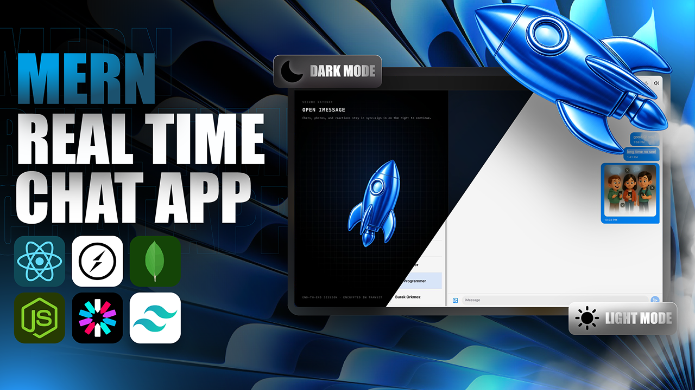

# iMessageBot

A full-stack real-time chat application inspired by iMessage. The project includes a React frontend, an Express backend, Clerk authentication, MongoDB persistence, Socket.IO messaging, ImageKit media uploads, custom themes, and wallpaper personalization.



## Features

- Real-time one-to-one messaging with Socket.IO
- Clerk authentication and user sync through webhooks
- MongoDB models for users and messages
- Online user presence tracking
- Image and video message support through ImageKit
- Responsive chat interface built with React, Tailwind CSS, and Hero UI
- Light and dark mode
- Theme preset picker and wallpaper picker
- Optional keyboard sound effects
- Backend cron job support for production keep-alive behavior
- Seed script for sample users

## Tech Stack

### Frontend

- React
- Vite
- Tailwind CSS
- Hero UI
- Zustand
- Socket.IO Client
- Axios
- Clerk React

### Backend

- Node.js
- Express
- MongoDB with Mongoose
- Socket.IO
- Clerk Express
- ImageKit
- Multer
- Cron

## Project Structure

```text
.
├── backend
│   ├── src
│   │   ├── controllers
│   │   ├── lib
│   │   ├── middleware
│   │   ├── models
│   │   ├── routes
│   │   ├── seeds
│   │   ├── webhooks
│   │   └── index.js
│   └── package.json
├── frontend
│   ├── public
│   ├── src
│   │   ├── components
│   │   ├── context
│   │   ├── data
│   │   ├── hooks
│   │   ├── lib
│   │   ├── pages
│   │   ├── store
│   │   └── App.jsx
│   └── package.json
└── Dockerfile
```

## Environment Variables

Create a `.env` file inside `backend`:

```bash
PORT=3000
NODE_ENV=development
MONGO_URI=your_mongodb_connection_string

CLERK_PUBLISHABLE_KEY=your_clerk_publishable_key
CLERK_SECRET_KEY=your_clerk_secret_key
CLERK_WEBHOOK_SIGNING_SECRET=your_clerk_webhook_signing_secret

IMAGEKIT_PRIVATE_KEY=your_imagekit_private_key

FRONTEND_URL=http://localhost:5173
```

Create a `.env` file inside `frontend`:

```bash
VITE_CLERK_PUBLISHABLE_KEY=your_clerk_publishable_key
```

## Local Development

Install backend dependencies:

```bash
cd backend
npm install
```

Install frontend dependencies:

```bash
cd frontend
npm install
```

Start the backend server:

```bash
cd backend
npm run dev
```

Start the frontend dev server:

```bash
cd frontend
npm run dev
```

Default local URLs:

- Frontend: `http://localhost:5173`
- Backend API: `http://localhost:3000/api`

## Useful Scripts

### Backend

```bash
npm run dev
npm run start
npm run build
npm run db:seed
```

### Frontend

```bash
npm run dev
npm run build
npm run lint
npm run preview
```

## Production Build

Build the frontend:

```bash
cd frontend
npm run build
```

Build the backend:

```bash
cd backend
npm run build
```

## Deployment Notes

- Set `NODE_ENV=production` for the backend in production.
- Set `FRONTEND_URL` to the deployed frontend URL.
- Configure Clerk webhook delivery to point to the backend webhook endpoint.
- Configure MongoDB Atlas or another hosted MongoDB connection string through `MONGO_URI`.
- Configure ImageKit credentials before using media uploads.

## Repository

GitHub: https://github.com/G-saimohan/imessagebot
